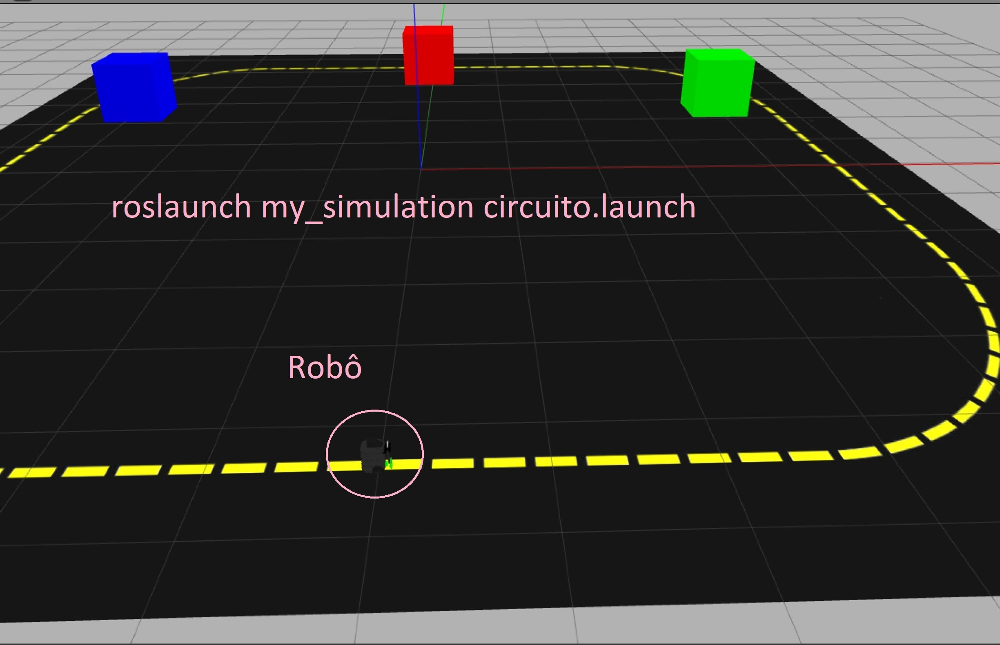
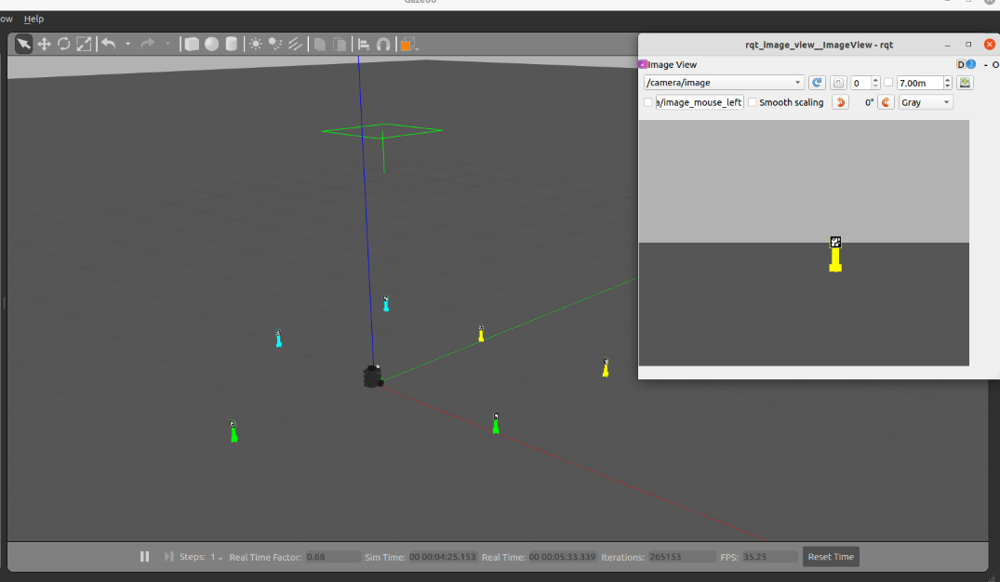

# Robótica Computacional 2022.2

## Avaliação Final (P2)

**Indique seu nome e as questões que escolheu fazer logo abaixo**

Nome:_______________

**Observações de avaliações nesta disciplina:**

* Clone o repositório da prova dentro de `~/catkin_ws/src` se estiver trabalhando no Linux.
* Você poderá dar quantos `git push` quiser no repositório, apenas o último será considerado.
* Antes de finalizar a prova verifique que os arquivos enviados ao github estão na sua última versão. É sua responsabilidade garantir isso.
* Só finalize a prova no Blackboard após enviar a prova via Github classroom.
* Ponha o nome no enunciado da prova no Github
* Tenha os repositórios https://github.com/arnaldojr/my_simulation e https://github.com/arnaldojr/mybot_description.git  atualizados em seu `catkin_ws/src`.
* Você pode consultar a internet ou qualquer material, mas não pode se comunicar com pessoas ou colegas a respeito da prova
* Todos os códigos fornecidos adicionalmente aos scripts em que as questões serão desenvolvidas foram testados em outro contexto, e são apenas um compilado. Não é obrigatório usar. Fique à vontade para modificar esse código e trazer outros arquivos que achar melhor. 
* Teste sempre seu código
* Entregue código que executa - código com erro que impede de executar implica em zero na questào
* Faça commits e pushes frequentes no seu repositório (tem dicas [no final deste arquivo](./instrucoes_setup.md))
* Permite-se consultar qualquer material online ou próprio. Não se pode compartilhar informações com colegas durante a prova.
* Faça commits frequentes. Em caso de disputa sobre plágio, o primeiro a enviar alguma ideia será considerado autor original.
* A responsabilidade por ter o *setup* funcionando é de cada estudante.
* Questões de esclarecimento geral podem ser perguntadas em voz alta na sala de aplicação da prova. Uma mesma pergunta não será respondida duas vezes.
* É proibido colaborar ou pedir ajuda a colegas ou qualquer pessoa que conheça os assuntos avaliados nesta prova.
* Os exercícios admitem diversas estratégias de resolução. A prova de cada aluno é única. Atenha-se apenas à rubrica de cada questão.

Existe algumas dicas de referência rápida de setup [instrucoes_setup.md](instrucoes_setup.md)

**Integridade Intelectual**

Se você tiver alguma evidência de fraude cometida nesta prova, [use este serviço de e-mail anônimo](https://www.guerrillamail.com/pt/compose)  para informar ao professor através do e-mail `igorsm1@insper.edu.br`.

## Questão 1

Para executar o cenário, faça:

    roslaunch my_simulation circuito.launch

Note que o cenario está no repositório `my_simulation`, portanto é fundamental você já ter realizado os passos de atualização descritos acima.

Seu robô está num cenário como o que pode ser visto na figura: 

</img>

#### O que é para fazer

Faça o robô seguir a pista amarela até encontrar a sua caixa preferencial conforme a tabela abaixo. 

Quem cujo primeiro nome se inicia com determinada letra da tabela abaixo, deve inicialmente se aproximar da figura correspondente:

|Letra inicial do nome| Figura inicial| 
|---|---|
| A até C | AZUL|
| D até H | VERMELHO |
| I até P | VERDE |
| Q até Z | AZUL |

O robô não deve deixar a pista amarela, deve apenas seguir até se aproximar da caixa. Quando estiver próximo da caixa deve parar com a caixa em sua área de visão. Não é preciso que a caixa esteja bem centralizada. 

Para conseguir a questão completa é preciso conseguir fazer o robô seguir a pista rápido com base no ângulo da faixa amarela na imagem.

#### Dicas

Talvez estes conteúdos ajudem:

[Regressão trocando x-y com todos os pixels amarelos https://github.com/Insper/robot21.1/blob/main/aula03/aula03_RegressaoPixelsAmarelos.ipynb](https://github.com/Insper/robot21.1/blob/main/aula03/aula03_RegressaoPixelsAmarelos.ipynb)

[Centro de massa de pixels amarelos](https://github.com/Insper/robot21.1/blob/main/aula03/centro_do_amarelo.py)

#### Detalhes de como rodar

O código para este exercício deve estar em: `p1_211/scripts/Q1.py`

Para rodar, recomendamos que faça:

    roslaunch my_simulation circuito.launch

Depois o seu código:

    rosrun p1_211 Q1.py

|Resultado| Conceito| 
|---|---|
| Não executa | 0 |
| Filtra o amarelo| 0.5|
| Segue a pista com base em centro de massa | 1.33|
| Identifica caixa e para no lugar certo | +1|
| Usa o ângulo da faixa na tela para acelerar quando o robô está em trechos retos da pista | +1|

Casos intermediários ou omissos da rubrica serão decididos pelo professor.

## Questão 2

Seu robô está no cenário visível abaixo:

    roslaunch my_simulation encaixotado.launch

#### O que é para fazer

Gire o robô até encontrar o bloco com a figura assinalada (veja a tabela abaixo). Ao centralizar a figura, use o lidar para chegar próximo (30 cm) daquela figura. Depois, gire 180 graus e pare a 30 cm do bloco que está diametralmente oposto.

Quem cujo primeiro nome se inicia com determinada letra da tabela abaixo, deve inicialmente se aproximar da figura correspondente:

|Letra inicial do nome| Figura inicial| 
|---|---|
| A até C | Cachorro |
| D até H | Cavalo |
| I até P | Bicicleta |
| Q até Z | Carro |

#### Detalhes de como rodar

O código para este exercício está em: `p1_221/scripts/Q2.py`

Para rodar, recomendamos que faça:

    roslaunch my_simulation encaixotado.launch

Depois:

    rosrun p1_221 Q2.py

|Resultado| Conceito| 
|---|---|
| Não executa | 0 |
| Faz o robô detectar a primeira figura apenas, e mostra evidências | 1.0 |
| Consegue centralizar na primeira figura | 1.50|
| Chega próximo à primeira figura | 2.00|
| Dá a volta e chega na segunda figura | 2.50|

## Questão 3 

No cenário representado abaixo, você deverá fazer o robô derrubar os creepers amarelos, em ordem crescente de ID Aruco.
Para derrubar o creeper, o robô deverá parar a 30 cm do mesmo, eriçar a garra e avaçar sobr o creeper até derrubá-lo.
Após derrubar o primeiro creeper, o robô deverá voltar à posição inicial usando a odometria.

#### O que é para fazer

Você deverá trabalhar no arquivo `p1_211/scripts/Q3.py`. Se quiser pode modificar os arquivos auxiliares, porém os mesmoms devem ser commitados junto com o arquivo da questão. 

#### Detalhes de como rodar

Para subir o cenário:

    roslaunch my_simulation reuniao.launch
    roslaunch mybot_description mybot_control2.launch

Para rodar o programa, você pode:
1. Abrir o VSCode na pasta do aqruivo e dar o `play`
2. Executar o comando do ROS: `rosrun p1_221 Q3.py`

|Resultado| Conceito| 
|---|---|
| Não executa | 0 |
| Faz o robô detectar a cor amarela e os Arucos | 1.0 |
| Derruba um creeper  | 1.5 |
| Derruba um creeper e volta | 2.0 |
| Derruba os creeper mas fora de ordem | 2.5|
| Faz o que foi pedido | 3.3|

